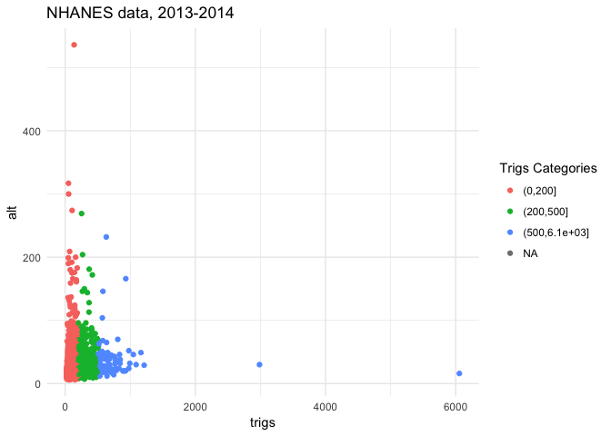
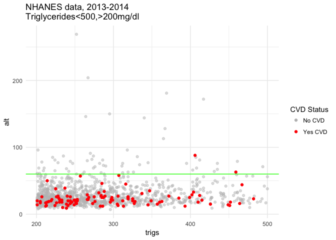

NHANES - ALT in CVD
================
Jessica Minnier, <minnier@ohsu.edu>
2/5/2018

We define CVD as no history of HF, with history of either CHD, angina, MI, or stroke, based on self report from the medical questionnaire data ([MCQ\_H](https://wwwn.cdc.gov/Nchs/Nhanes/2013-2014/MCQ_H.htm)). The triglycerides and ALT values are from Biological Profile ([BIOPRO\_H](https://wwwn.cdc.gov/Nchs/Nhanes/2013-2014/BIOPRO_H.htm)). We examine proportion of ALT &lt; 60 U/L, and categorize triglyceride levels into 0-200, 200-500, and 500+ categories. We are interested in the distribution of ALT in subjects with triglycerides between 200 and 500 and with CVD (not heart failure).

Below we can see the observed values of ALT vs triglycerides in the NHANES data 2013-2014. There are 10175 subjects in this year of data, and 0 with CVD (as defined). We must use survey design methods to estimate the prevalence and quantiles of variables of interest witin the full US population, which the survey sample is designed to represent.

CVD and Triglycerides
---------------------

In the total adult population, 6.1% of adults in the US fulfill our definition of CVD. This equates to 14100763 people in the US.

Here we have a table of the proportion of CVD within each category of triglycerides.

| Trig. Categories |  Proportion CVD|  SE of proportion|
|:-----------------|---------------:|-----------------:|
| (0,200\]         |           0.057|             0.004|
| (200,500\]       |           0.082|             0.013|
| (500,6.1e+03\]   |           0.042|             0.021|

Distribution of ALT
-------------------

We now examine the distribution of ALT within subjects who have CVD (by our definition) and have triglycerides between 200 and 500 mg/dl.

First we can look at the quantiles and median of ALT. These are subjects with triglycerides &gt; 200 and &lt; 500, subset by CVD yes or no.

| CVD yes/no |  min|  5th %ile|  25th %ile|  median|  75th %ile|  95th %ile|  max|
|:-----------|----:|---------:|----------:|-------:|----------:|----------:|----:|
| CVD=FALSE  |    7|        13|       19.0|      26|         35|       67.4|  269|
| CVD=TRUE   |    9|        12|       16.1|      21|         27|       44.1|   88|

Now we look at the proportion with ALT &lt; 60 U/L. These are subjects with triglycerides &gt; 200 and &lt; 500, subset by CVD yes or no.

| CVD yes/no |  Proportion ALT &lt; 60 U/L|  SE of proportion|
|:-----------|---------------------------:|-----------------:|
| CVD=FALSE  |                       0.938|             0.009|
| CVD=TRUE   |                       0.989|             0.009|

Therefore, based on the NHANES data, we conclude that 98.9% of subjects with CVD (as defined) and triglycerides &lt;200&&gt;500 have ALT &lt; 60 U/L.
