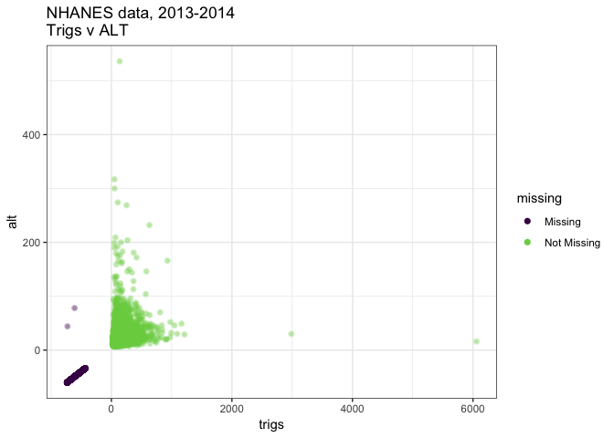
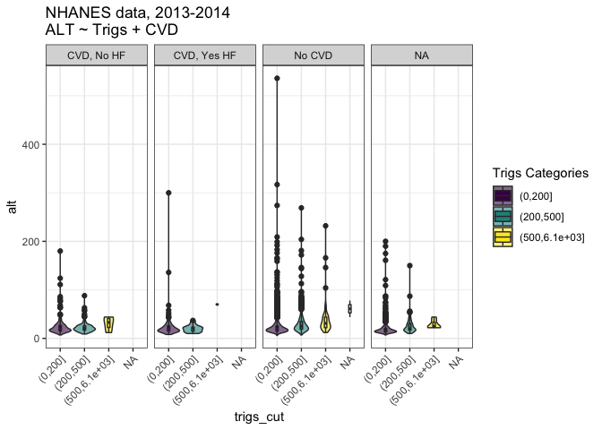
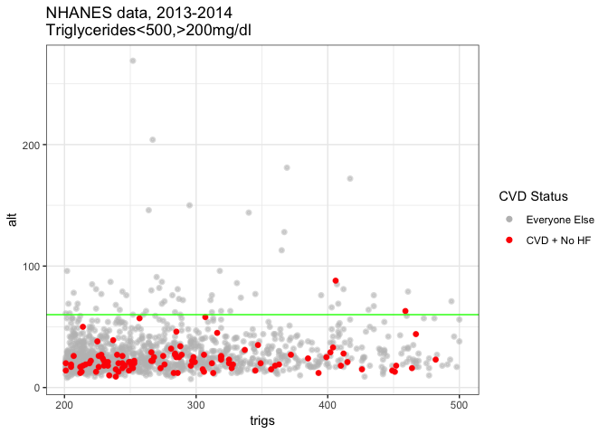
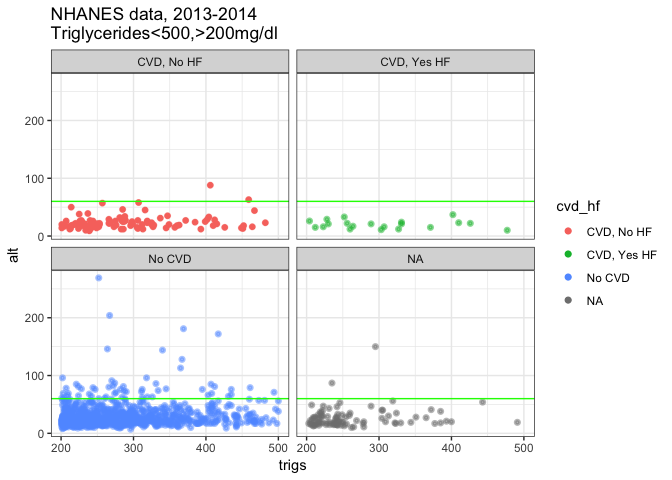

NHANES CVD Example
================
Jessica Minnier, <minnier@ohsu.edu>
2018-11-12

<!--Hello contributor! This is an md generated from an Rmd. Please edit the Rmd-->
NHANES Data
===========

The [NHANES (National Health and Nutrition Examination Survey)](https://www.cdc.gov/nchs/nhanes/index.htm) is a publicly available data set from the CDC that is useful for studying health outcomes of children and adults in the US. The data is available in the form of individual worksheets for each year of the study. There are some cleaned and processed versions of the data, but they are often small subsets of the data, such as the `NHANES` R package. NHANES data is survey data, which means we must take into account the sampling weights when analyzing the data so that we appropriately represent the population that we wish to make inferences about.

Motivation
==========

This is an example of using the [`nhanesA`](https://cran.r-project.org/web/packages/nhanesA/index.html) package to pull raw NHANES data and process it enough to calculate a proportion of interest. See the package [vignette](https://cran.r-project.org/web/packages/nhanesA/vignettes/Introducing_nhanesA.html) for more examples. This example looks at one year of data from 3 worksheets.

Note, there is another package called [`RNHANES`](https://cran.r-project.org/web/packages/RNHANES/) that can be used to pull raw data, as well; see this [blog post](https://silentspring.org/devblog/2016/11/22/nhanes-made-simple-with-rnhanes.html).

Scientific Question
===================

**What is the proportion of people who have Alanine aminotransferase (ALT) &lt; 60 U/L within the population of people with cardiovascular disease (CVD) and triglycerides between 200-500 mg/dl.** (This was a question motivated by a collaborator who needed to know how many people could be accrued into a clinical study.)

We define CVD as no history of HF, with history of either CHD, angina, MI, or stroke, based on self report from the medical questionnaire data ([MCQ\_H](https://wwwn.cdc.gov/Nchs/Nhanes/2013-2014/MCQ_H.htm)). The triglycerides and ALT values are from Biological Profile ([BIOPRO\_H](https://wwwn.cdc.gov/Nchs/Nhanes/2013-2014/BIOPRO_H.htm)). We examine proportion of ALT &lt; 60 U/L, and categorize triglyceride levels into 0-200, 200-500, and 500+ categories. We are interested in the distribution of ALT in subjects with triglycerides between 200 and 500 mg/dl and with CVD (without heart failure).

Pull Data
=========

BIOPRO\_H survey
----------------

This survey contains triglycerides and ALT values.

We use `nhanesA::nhanes()` function to pull data from the worksheet by name. NHANES tables are stored in SAS '.XPT' format. This function returns a data frame with label attributes (see `?Hmisc::label`), which causes some issues when using regular R functions.

``` r
# https://wwwn.cdc.gov/Nchs/Nhanes/2013-2014/BIOPRO_H.htm.
biopro <- nhanes('BIOPRO_H') 
```

    ## Processing SAS dataset BIOPRO_H   ..

``` r
class(biopro)
```

    ## [1] "data.frame"

``` r
# str(biopro) #throws an error
```

The labels are stored as a named character vector like so:

``` r
Hmisc::label(biopro) %>% head # what do the labels look like
```

    ##                                    SEQN 
    ##            "Respondent sequence number" 
    ##                                  LBXSAL 
    ##                        "Albumin (g/dL)" 
    ##                                LBDSALSI 
    ##                         "Albumin (g/L)" 
    ##                                LBXSAPSI 
    ##           "Alkaline phosphatase (IU/L)" 
    ##                                LBXSASSI 
    ## "Aspartate aminotransferase AST (IU/L)" 
    ##                                LBXSATSI 
    ##   "Alanine aminotransferase ALT (IU/L)"

In order to use tidyverse functions from `dplyr` on the resulting data set, we remove the labels using a function `clear_labels()` defined in the file `00_fun_data_helpers.R`.

``` r
# store the labels for later
biopro_labels <- Hmisc::label(biopro)
# clear 'em out!
biopro <- clear_labels(biopro)
```

We create the variables of interest, give them friendlier names, and keep the ID variable `SEQN` to link to other data sets.

``` r
biopro <- biopro %>%
  select(SEQN,LBXSATSI,LBXSTR) %>%
  rename(trigs=LBXSTR,
         alt=LBXSATSI) %>%
  mutate(trigs_cut=cut(trigs,c(0,200,500,6100)),
         alt_low = 1*(alt<60))
glimpse(biopro)
```

    ## Observations: 6,979
    ## Variables: 5
    ## $ SEQN      <int> 73557, 73558, 73559, 73561, 73562, 73564, 73566, 735...
    ## $ alt       <int> 16, 29, 16, 28, 16, 21, 24, 20, 23, 27, 20, 15, 44, ...
    ## $ trigs     <int> 140, 257, 51, 88, 327, 68, 262, 39, 31, 284, 23, 49,...
    ## $ trigs_cut <fct> (0,200], (200,500], (0,200], (0,200], (200,500], (0,...
    ## $ alt_low   <dbl> 1, 1, 1, 1, 1, 1, 1, 1, 1, 1, 1, 1, 1, NA, 1, 1, 1, ...

DEMO\_H survey
--------------

Here, we obtain the demographic variables. This also contains all the survey design variables

``` r
# https://wwwn.cdc.gov/nchs/nhanes/2013-2014/demo_h.htm
demo <- nhanes('DEMO_H')
```

    ## Processing SAS dataset DEMO_H     ..

``` r
demo_labels <- Hmisc::label(demo)
demo <- clear_labels(demo)
```

The function `nhanesA::nhanesTranslate()` translates categorical variables to meaningful categories (i.e. No/Yes or Male/Female vs the default numbering 1/2). For example, race, pregnancy, and sex variables are easier to use when the categories are labeled:

``` r
demo_vars = c("RIAGENDR","RIDEXPRG","RIDRETH3")
demo <- nhanesA::nhanesTranslate('DEMO_H', demo_vars, data=demo)
demo <- demo %>% 
  mutate(sex=RIAGENDR,pregnant=RIDEXPRG,race=RIDRETH3,age=RIDAGEYR)

glimpse(demo %>% select(sex, pregnant, race, age)) # just to see a few categories
```

    ## Observations: 10,175
    ## Variables: 4
    ## $ sex      <fct> Male, Male, Male, Male, Female, Male, Male, Female, M...
    ## $ pregnant <fct> NA, NA, NA, NA, NA, NA, NA, NA, NA, NA, NA, The parti...
    ## $ race     <fct> Non-Hispanic Black, Non-Hispanic White, Non-Hispanic ...
    ## $ age      <int> 69, 54, 72, 9, 73, 56, 0, 61, 42, 56, 65, 26, 0, 9, 7...

``` r
demo %>% tabyl(race) %>% adorn_totals()
```

| race                             |      n|    percent|
|:---------------------------------|------:|----------:|
| Mexican American                 |   1730|  0.1700246|
| Other Hispanic                   |    960|  0.0943489|
| Non-Hispanic White               |   3674|  0.3610811|
| Non-Hispanic Black               |   2267|  0.2228010|
| Non-Hispanic Asian               |   1074|  0.1055528|
| Other Race - Including Multi-Rac |    470|  0.0461916|
| Total                            |  10175|  1.0000000|

``` r
demo %>% tabyl(pregnant) %>% adorn_totals()
```

| pregnant                         |      n|    percent|  valid\_percent|
|:---------------------------------|------:|----------:|---------------:|
| Yes, positive lab pregnancy test |     65|  0.0063882|       0.0496562|
| The participant was not pregnant |   1150|  0.1130221|       0.8785332|
| Cannot ascertain if the particip |     94|  0.0092383|       0.0718105|
| NA                               |   8866|  0.8713514|              NA|
| Total                            |  10175|  1.0000000|       1.0000000|

MCQ\_H survey
-------------

This survey has history of cardiovascular disease data. We create a composite CVD variable, break it up into heart failure (HF) categories in `cvd_hf`, and further restrict to CVD cases without heart failure in the variable `cvd_nohf`.

``` r
# https://wwwn.cdc.gov/Nchs/Nhanes/2013-2014/MCQ_H.htm
mcq <- nhanes('MCQ_H')
```

    ## Processing SAS dataset MCQ_H      ..

``` r
mcq_labels <- Hmisc::label(mcq)
mcq <- clear_labels(mcq)
# MCQ160b - Ever told had congestive heart failure
# MCQ160c - Ever told you had coronary heart disease
# MCQ160d - Ever told you had angina/angina pectoris
# MCQ160e - Ever told you had heart attack
# MCQ160f - Ever told you had a stroke
mcq_vars = c("MCQ160B","MCQ160C","MCQ160D",
              "MCQ160E","MCQ160F")
mcq <- nhanesTranslate('MCQ_H', mcq_vars, data=mcq)
mcq <- mcq %>% 
  select(SEQN,one_of(mcq_vars))
colnames(mcq)[-1] <- c("chf","chd","angina","MI","stroke")
mcq <- mcq%>%
  mutate(
    cvd = 1*((chd=="Yes")|(angina=="Yes")|(MI=="Yes")|(stroke=="Yes")),
    cvd_hf = case_when(
      cvd==0 ~ "No CVD",
      (chf=="No")&(cvd==1) ~ "CVD, No HF",
      (chf=="Yes")&(cvd==1) ~ "CVD, Yes HF",
      TRUE ~ as.character(NA)),
    cvd_nohf = case_when( # Only care about cvd+noHF = 1, vs all else 0 (including NAs)
      cvd_hf=="CVD, No HF" ~ 1,
      TRUE ~ 0
    )) 
```

Table of CVD vs CVD with HF info:

``` r
mcq %>%
  tabyl(chf,cvd) %>%
  adorn_title() %>%
  kable
```

|            | cvd  |     |      |
|------------|:-----|-----|------|
| chf        | 0    | 1   | NA\_ |
| Yes        | 61   | 121 | 0    |
| No         | 5169 | 410 | 0    |
| Don't know | 5    | 3   | 0    |
| NA         | 0    | 0   | 4001 |

``` r
mcq %>%
  tabyl(cvd_hf,cvd) %>%
  adorn_title() %>%
  kable
```

|             | cvd  |     |      |
|-------------|:-----|-----|------|
| cvd\_hf     | 0    | 1   | NA\_ |
| CVD, No HF  | 0    | 410 | 0    |
| CVD, Yes HF | 0    | 121 | 0    |
| No CVD      | 5235 | 0   | 0    |
| NA          | 0    | 3   | 4001 |

``` r
mcq %>%
  tabyl(cvd_nohf,cvd) %>%
  adorn_title() %>%
  kable
```

|           | cvd  |     |      |
|-----------|:-----|-----|------|
| cvd\_nohf | 0    | 1   | NA\_ |
| 0         | 5235 | 124 | 4001 |
| 1         | 0    | 410 | 0    |

Join
----

Here we join all the data from the three worksheets:

``` r
mydata <- left_join(demo,mcq,by="SEQN")
mydata <- left_join(mydata,biopro,by="SEQN")
```

Analysis
========

Below we can see the observed values of ALT vs triglycerides in the NHANES data 2013-2014. There are 10175 subjects in this year of data, and 410 with CVD (as defined). We must use survey design methods to estimate the prevalence and quantiles of variables of interest within the full US population, which the survey sample is designed to represent.

Visualization
-------------

First, we visualize the data to get a sense of the ALT distributions. It looks like there are some extreme values for both triglycerides (&gt; 6000?!) and ALT. If we were doing more in depth analyses, we should probably worry about those more. But, we're interested in a more restricted population.

``` r
theme_set(theme_bw())

ggplot(mydata,aes(x=trigs,y=alt))+
  geom_miss_point(alpha=.3)+
  ggtitle("NHANES data, 2013-2014\nTrigs v ALT") +
  scale_color_viridis_d(end = .8)
```



``` r
ggplot(mydata, aes(x=trigs_cut,y=alt,fill=trigs_cut)) +
  geom_violin(alpha=.6)+
  geom_boxplot(width=.1)+
  ggtitle("NHANES data, 2013-2014\nALT ~ Trigs + CVD")+
  scale_fill_viridis_d(name="Trigs Categories")+
  theme(axis.text.x = element_text(angle = 45, hjust = 1)) +
  facet_grid(.~cvd_hf)
```



Now, we restrict trigs to between 200 and 500 mg/dl. We can see that most of the patients with CVD have ALT less than 60 U/L. The green line represents the ALT cutoff of 60 U/L.

``` r
ggplot(mydata%>%filter(trigs_cut=="(200,500]"),aes(x=trigs,y=alt,col=factor(cvd_nohf)))+
  geom_miss_point(alpha=0.5)+
  ggtitle("NHANES data, 2013-2014\nTriglycerides<500,>200mg/dl") + 
  scale_color_manual(values = c("grey","red"),labels=c("Everyone Else","CVD + No HF"),name="CVD Status")+
  geom_point(data=mydata%>%filter(trigs_cut=="(200,500]",cvd_nohf==1))+
  geom_hline(yintercept=60,color="green")
```



``` r
ggplot(mydata%>%filter(trigs_cut=="(200,500]"),aes(x=trigs,y=alt,col=cvd_hf))+
  geom_miss_point(alpha=0.5)+
  ggtitle("NHANES data, 2013-2014\nTriglycerides<500,>200mg/dl") + 
  facet_wrap(~cvd_hf)+
  geom_point(data=mydata%>%filter(trigs_cut=="(200,500]",cvd_nohf==1))+
  geom_hline(yintercept=60,color="green")
```



Survey design
-------------

Here comes the meat of it all. We use the `survey::svydesign()` function to specify the survey design and implement survey weighting. We need to specify the strata, id, and weight variables. Most survey data will give you example code to specify your model and you can determine the proper design from the code if not the description of the sampling design.

``` r
(nhanes_surv <- svydesign(strata=~SDMVSTRA, id=~SDMVPSU, weights=~WTMEC2YR, data=mydata, nest=TRUE))
```

    ## Stratified 1 - level Cluster Sampling design (with replacement)
    ## With (30) clusters.
    ## svydesign(strata = ~SDMVSTRA, id = ~SDMVPSU, weights = ~WTMEC2YR, 
    ##     data = mydata, nest = TRUE)

Once we have the survey design specified, we can use analysis functions in the `survey` package to calculate proportions and weighted totals.

Note, when we wish to examine a subset of the data, such as adults (`age>18`), we must specify this in the design. We cannot simply remove that subset of the data through filtering, because the survey weights will no longer be correct.

``` r
nhanes_adult <- subset(nhanes_surv,age>=18)
```

Weighted means, proportions, totals
-----------------------------------

We can use svymean to calculate weighted means of variables, including proportions (means of binary variables 0/1).

``` r
(svy_mean_alt <- svymean(~alt,design=nhanes_adult,na.rm=T))
```

    ##       mean     SE
    ## alt 25.183 0.3692

``` r
(svy_mean_cvd <- svymean(~cvd_hf,design=nhanes_adult,na.rm=T))
```

    ##                       mean     SE
    ## cvd_hfCVD, No HF  0.061540 0.0041
    ## cvd_hfCVD, Yes HF 0.016993 0.0019
    ## cvd_hfNo CVD      0.921467 0.0047

We can also estimate the total number of adults in the full population with `svytotal`.

``` r
svy_mean_total <- svytotal(~cvd_hf,design=nhanes_adult,na.rm=T)
svy_mean_total %>% kable(digits=1)
```

|                    |      total|          SE|
|--------------------|----------:|-----------:|
| cvd\_hfCVD, No HF  |   14100763|   1179756.7|
| cvd\_hfCVD, Yes HF |    3893541|    418087.4|
| cvd\_hfNo CVD      |  211136133|  11174750.5|

In the total adult population, 6.2% of adults in the US fulfill our definition of CVD. This equates to 14100763 people in the US.

Here we have a table of the proportion of CVD within each category of triglycerides.

``` r
tmp = svyby(~cvd_nohf,~trigs_cut,design=nhanes_adult, svymean, na.rm=T) 
colnames(tmp) = c("Trig. Categories","Proportion CVD","SE of proportion")
kable(tmp,digits=3,row.names = FALSE)
```

| Trig. Categories |  Proportion CVD|  SE of proportion|
|:-----------------|---------------:|-----------------:|
| (0,200\]         |           0.056|             0.004|
| (200,500\]       |           0.081|             0.013|
| (500,6.1e+03\]   |           0.042|             0.021|

Distribution of ALT
-------------------

We now examine the distribution of ALT within subjects who have CVD (by our definition) and have triglycerides between 200 and 500 mg/dl.

First we can look at the quantiles and median of ALT. These are subjects with triglycerides &gt; 200 and &lt; 500, subset by CVD yes or no.

``` r
nhanes_trigs = subset(nhanes_adult,(trigs_cut=="(200,500]"))

tmp = svyby(~alt,~cvd_nohf,
      design=nhanes_trigs, 
      svyquantile, quantiles=c(0,0.05,0.25,0.5,0.75,0.95,1),ci=TRUE)
## without ci=TRUE svyquantile does not compute standard errors
tmp[,1] = c("CVD=FALSE or NA","CVD=TRUE")
tmp = tmp%>%select(cvd_nohf:`1`)
colnames(tmp) = c("CVD yes/no","min","5th %ile","25th %ile", "median", "75th %ile","95th %ile","max")
kable(tmp,digits=1,row.names = FALSE)
```

| CVD yes/no      |  min|  5th %ile|  25th %ile|  median|  75th %ile|  95th %ile|  max|
|:----------------|----:|---------:|----------:|-------:|----------:|----------:|----:|
| CVD=FALSE or NA |    7|        13|       19.0|      26|         35|       67.7|  269|
| CVD=TRUE        |    9|        12|       16.1|      21|         27|       44.1|   88|

How does this differ from the quantiles of the NHANES data without using survey weights? We can see that the min and max stay the same, but the percentiles change slightly. This is because this is the finite sample data quantiles, and does not represent the full population from which the data is sampled.

``` r
tmp <- mydata %>% 
  filter(age>=18,
         trigs_cut=="(200,500]") %>%
  group_by(cvd_nohf) %>%
  summarize_at(.vars = vars(alt),
               .funs = funs(min,
                            '55th %isle'=quantile(.,probs = .05),
                            '25th %isle'=quantile(.,probs = .25),
                            median,
                            '75th %isle'=quantile(.,probs = .75),
                            '95th %isle'=quantile(.,probs = .95),
                            max))
tmp[,1] = c("CVD=FALSE or NA","CVD=TRUE")
colnames(tmp)[1] = c("CVD yes/no")
kable(tmp,digits=1,row.names = FALSE)
```

| CVD yes/no      |  min|  55th %isle|  25th %isle|  median|  75th %isle|  95th %isle|  max|
|:----------------|----:|-----------:|-----------:|-------:|-----------:|-----------:|----:|
| CVD=FALSE or NA |    7|          13|          19|      25|        34.8|        62.0|  269|
| CVD=TRUE        |    9|          12|          17|      21|        26.0|        45.9|   88|

Now, we can explicitly answer our question of interest with `svyby` (we could also have used `svymean`) what is the proportion of people with ALT &lt; 60 within the population of CVD (no HF) patients with trigs between 200-500?

``` r
tmp = svyby(~alt_low, ~cvd_hf,design=nhanes_trigs, svymean, na.rm=T) 
colnames(tmp) = c("CVD Categories","Proportion ALT < 60","SE of proportion")
kable(tmp,digits=3,row.names = FALSE)
```

| CVD Categories |  Proportion ALT &lt; 60|  SE of proportion|
|:---------------|-----------------------:|-----------------:|
| CVD, No HF     |                   0.989|             0.009|
| CVD, Yes HF    |                   1.000|             0.000|
| No CVD         |                   0.935|             0.009|

``` r
myprop <- tmp %>% filter(`CVD Categories`=="CVD, No HF") %>% pull(`Proportion ALT < 60`)
```

Conclusion
==========

So, we have our answer. Based on the 2013-2014 NHANES data, we estimate that approximately 98.9% of patients have ALT &lt; 60 in our sub-population of interest (CVD, no HF, trigs between 200-500).
